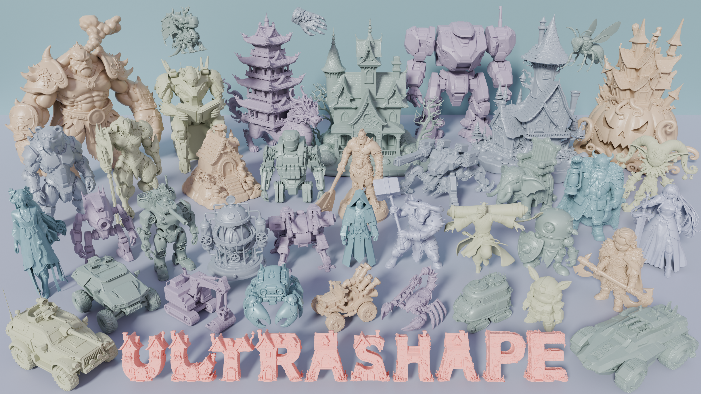

<div align="center">

<h1>UltraShape 1.0 - Mac/MPS Port</h1>

<p><strong>High-Fidelity 3D Shape Generation via Scalable Geometric Refinement</strong></p>

<a href="https://arxiv.org/pdf/2512.21185"></a>
<a href="https://pku-yuangroup.github.io/UltraShape-1.0/"></a>
<a href="https://huggingface.co/infinith/UltraShape"></a>

</div>

<br/>

## About This Fork

This is a **Mac/Apple Silicon (MPS) compatible port** of [UltraShape 1.0](https://github.com/PKU-YuanGroup/UltraShape-1.0) by PKU-Yuan-Lab. The original model requires NVIDIA CUDA GPUs, but this fork enables running on:

- **Apple Silicon Macs** (M1/M2/M3/M4) via MPS (Metal Performance Shaders)
- **CPU** (slower but universal)
- **NVIDIA GPUs** (original CUDA support preserved)

### What Changed

| Component | Original | This Fork |
|-----------|----------|-----------|
| Marching Cubes | `cubvh` (CUDA-only) | `scikit-image` fallback for MPS/CPU |
| Attention | `flash_attn` (CUDA-only) | PyTorch native `scaled_dot_product_attention` |
| SageAttention | Required for some modes | Optional, graceful fallback |
| torch_cluster | CUDA wheels only | Pure PyTorch FPS fallback |
| Device | CUDA hardcoded | Auto-detect CUDA/MPS/CPU |
| Autocast dtype | `bfloat16` | `float16` for MPS compatibility |

<br/>

<div align="center">
  
</div>

<br/>

## Installation

### Mac (Apple Silicon)

```bash
# Clone this repository
git clone https://github.com/199-biotechnologies/ultrashape-mac.git
cd ultrashape-mac

# Create conda environment
conda create -n ultrashape python=3.10
conda activate ultrashape

# Install PyTorch with MPS support
pip install torch torchvision torchaudio

# Install dependencies
pip install -r requirements.txt
```

### Linux/Windows (NVIDIA GPU)

```bash
# Clone this repository
git clone https://github.com/199-biotechnologies/ultrashape-mac.git
cd ultrashape-mac

# Create conda environment
conda create -n ultrashape python=3.10
conda activate ultrashape

# Install PyTorch with CUDA
pip install torch==2.5.1 torchvision==0.20.1 torchaudio==2.5.1 --index-url https://download.pytorch.org/whl/cu121

# Install dependencies
pip install -r requirements.txt

# Optional: Install CUDA-accelerated packages for better performance
pip install flash_attn==2.8.3
pip install git+https://github.com/ashawkey/cubvh --no-build-isolation
pip install https://data.pyg.org/whl/torch-2.5.0%2Bcu121/torch_cluster-1.6.3%2Bpt25cu121-cp310-cp310-linux_x86_64.whl
```

### Download Model Weights

Download the pre-trained weights from Hugging Face [[infinith/UltraShape](https://huggingface.co/infinith/UltraShape/tree/main)] and place them in your checkpoint directory (e.g., `./checkpoints/`).

## Usage

### 1. Generate Coarse Mesh

First, use [Hunyuan3D-2.1](https://github.com/Tencent-Hunyuan/Hunyuan3D-2.1) to generate a coarse mesh from your input image.

### 2. Refine with UltraShape

**Command Line:**
```bash
python scripts/infer_dit_refine.py \
    --image path/to/image.png \
    --mesh path/to/coarse_mesh.glb \
    --ckpt path/to/checkpoint.pt \
    --output_dir outputs
```

**Gradio Web UI:**
```bash
python scripts/gradio_app.py --ckpt path/to/checkpoint.pt
```

### Parameters

| Parameter | Default | Description |
|-----------|---------|-------------|
| `--steps` | 50 | Inference steps (reduce to 12 for faster generation) |
| `--num_latents` | 32768 | Number of latent tokens (reduce to 8192 if OOM) |
| `--chunk_size` | 8000 | Chunk size (reduce to 2048 if OOM) |
| `--octree_res` | 1024 | Marching cubes resolution |
| `--low_vram` | False | Enable CPU offloading for low VRAM |

### Mac-Specific Tips

1. **Memory**: Apple Silicon Macs share RAM between CPU and GPU. Close other apps to maximize available memory.
2. **First Run**: The first inference may be slower due to MPS kernel compilation.
3. **Reduce Settings**: If you encounter OOM errors, reduce `--num_latents` to 8192 and `--chunk_size` to 2048.

## Performance Notes

| Platform | Expected Performance |
|----------|---------------------|
| NVIDIA RTX 4090 | ~2-3 min per mesh (with flash_attn) |
| Apple M3 Max (64GB) | ~10-15 min per mesh |
| Apple M1 (16GB) | ~30+ min (may need reduced settings) |
| CPU only | 1+ hour |

## Original Paper

```bibtex
@article{jia2025ultrashape,
    title={UltraShape 1.0: High-Fidelity 3D Shape Generation via Scalable Geometric Refinement},
    author={Jia, Tanghui and Yan, Dongyu and Hao, Dehao and Li, Yang and Zhang, Kaiyi and He, Xianyi and Li, Lanjiong and Chen, Jinnan and Jiang, Lutao and Yin, Qishen and Quan, Long and Chen, Ying-Cong and Yuan, Li},
    journal={arxiv preprint arXiv:2512.21185},
    year={2025}
}
```

## Acknowledgements

- Original [UltraShape 1.0](https://github.com/PKU-YuanGroup/UltraShape-1.0) by PKU-Yuan-Lab
- [Hunyuan3D-2.1](https://github.com/Tencent-Hunyuan/Hunyuan3D-2.1) by Tencent
- [LATTICE](https://arxiv.org/abs/2512.03052) for inspiring the core methodology

## License

This project follows the same license as the original UltraShape 1.0 (TENCENT HUNYUAN NON-COMMERCIAL LICENSE AGREEMENT). See [LICENSE](LICENSE) for details.
